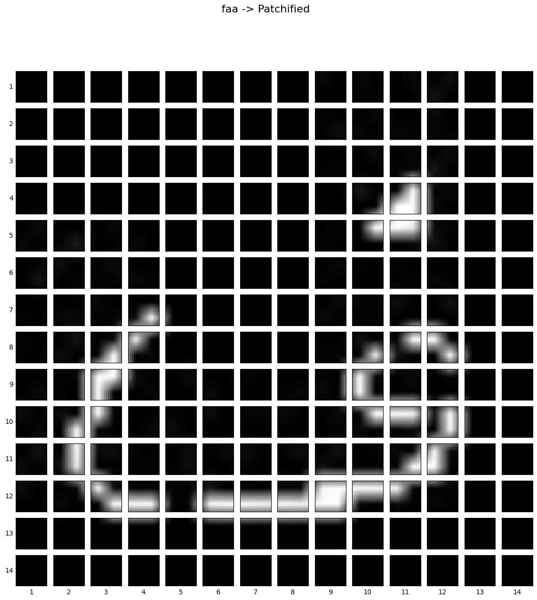
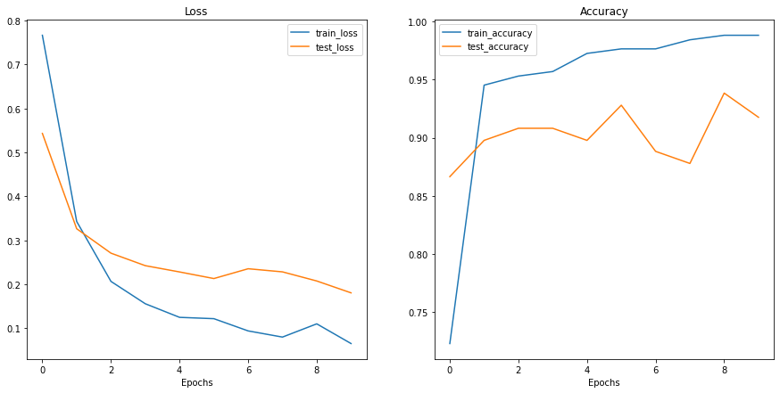

# ViT-Paper-Implementation

This repository contains the implementation of the paper [An Image is Worth 16x16 Words: Transformers for Image Recognition at Scale](https://arxiv.org/abs/2010.11929) by Alexey Dosovitskiy et al. The paper proposes a novel architecture called Vision Transformer (ViT) which applies the Transformer architecture to image recognition tasks. The authors show that ViT can perform well on image classification tasks when trained on large datasets. The paper also shows that ViT can be used for transfer learning on image classification tasks.

## Architecture


## Data
`data/train` contains 23 classes of Urdu Characters images on which we will train the architecture and then test it on `data/test`.
The images are resized to 224 x 224 pixels.

## Patchified Image for making embeddings


## Training
First install all the required dependencies by creating a virtual environment and running-
```bash
pip install -r requirements.txt
```

To train the model, run the following command:
```bash
python main.py
```

## Results
Achieves an overall testing accuracy of 92 %. Can be improved by transfer learning (obviously 😉)
